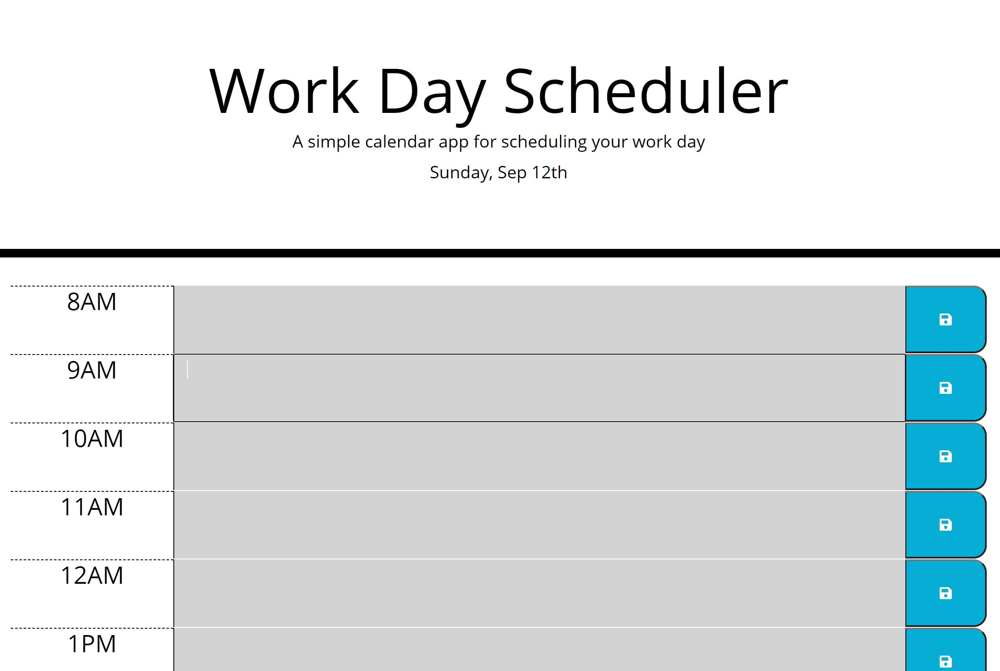

# Work Day Scheduler-Jquery, Bootstrap, and Moment.js

## Description

This is a project where I was given the index.html and style.css files for a basic website that can be used to input tasks to schedule for certain times of day. The project uses third-party APIs such as jQuery, Bootstrap, and Moment.js. The purpose of this project was to demonstrate how to use third-party APIs such as those listed.

The first task was to dynamically add the HTML for the time slots, text input, and save buttons. This was set to load automatically on refreshing the page, and used Bootstrap to set up columns and rows that spanned the page and were responsive.

I also had write Javascript that saved the text input to local storage, and would then get pulled back out and persist in the correct time slot.

Moment.js was used to indicate when a time slot had passed, was presently occurring, or if it was in the future. This meant checking the timeslots against the current time and then adding classes to the textarea elements that would change them to the appropriate color.

## Installation

You can find the deployed site [here.](https://allysonmcgrath.github.io/cbcchallenge5/)

To install the entire project and access the code, you can clone the repository by using the command prompt

$ git clone https://github.com/AllysonMcGrath/cbcchallenge5.git

Detailed instructions for cloning GitHub repositories can be found [here.](https://docs.github.com/en/github/creating-cloning-and-archiving-repositories/cloning-a-repository-from-github/cloning-a-repository)

## Usage

When displaying correctly, website should look like the image below:

Past times should be greyed out, present time should be red, and future times should be green.

Use standard git commands within this repository.

Examples:

$ git mv index.html ../
$ git add .
$ git commit -m "commit description"
$ git push origin main

## Credits

Trilogy Education Services, LLC, a 2U, Inc. brand

[Coding Boot Camp at UT](https://github.com/the-Coding-Boot-Camp-at-UT)

[Xander Rapstine](https://github.com/Xandromus)

[jQuery](https://jquery.com/)

[Moment.js](https://momentjs.com/)

[Font Awesome](https://fontawesome.com/)

[Bootstrap](https://getbootstrap.com/)

[Google Fonts](https://developers.google.com/fonts)

## License

MIT License

Copyright (c) 2021 Allyson McGrath

Permission is hereby granted, free of charge, to any person obtaining a copy
of this software and associated documentation files (the "Software"), to deal
in the Software without restriction, including without limitation the rights
to use, copy, modify, merge, publish, distribute, sublicense, and/or sell
copies of the Software, and to permit persons to whom the Software is
furnished to do so, subject to the following conditions:

The above copyright notice and this permission notice shall be included in all
copies or substantial portions of the Software.

THE SOFTWARE IS PROVIDED "AS IS", WITHOUT WARRANTY OF ANY KIND, EXPRESS OR
IMPLIED, INCLUDING BUT NOT LIMITED TO THE WARRANTIES OF MERCHANTABILITY,
FITNESS FOR A PARTICULAR PURPOSE AND NONINFRINGEMENT. IN NO EVENT SHALL THE
AUTHORS OR COPYRIGHT HOLDERS BE LIABLE FOR ANY CLAIM, DAMAGES OR OTHER
LIABILITY, WHETHER IN AN ACTION OF CONTRACT, TORT OR OTHERWISE, ARISING FROM,
OUT OF OR IN CONNECTION WITH THE SOFTWARE OR THE USE OR OTHER DEALINGS IN THE
SOFTWARE.
